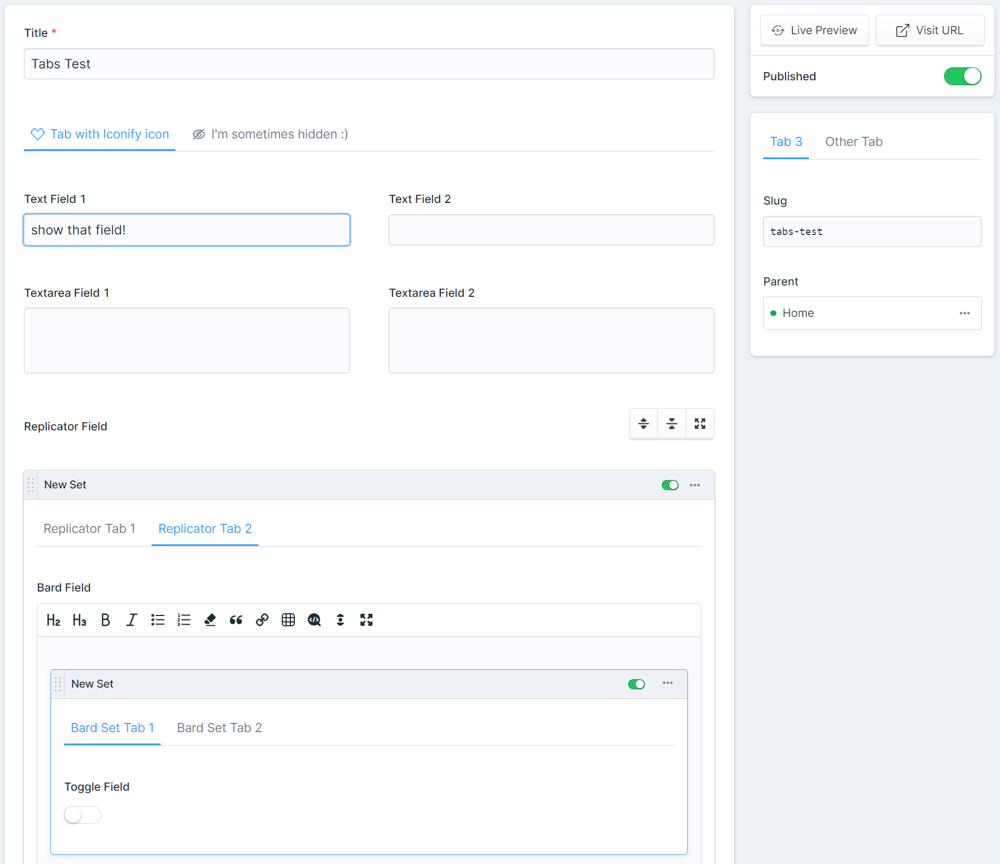
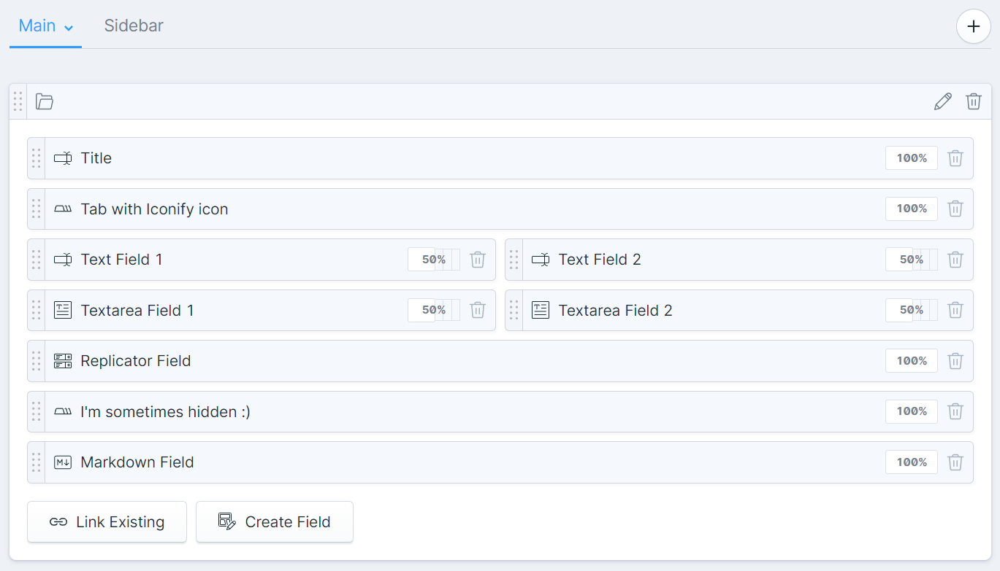

# Statamic Tabs

A Statamic addon to add a Tab Fieldtype. Add tabs anywhere you have other fields!



## Installation

Install this addon using composer.

```cli
composer require eminos/statamic-tabs
```

## Statamic support

| Statamic version | Addon version | Addon branch |
| --- | --- | --- |
| Statamic 5 | `1.x` | `1.x` |
| Statamic 6 | `2.x` | `main` |

## Features

- Add Tabs anywhere you need them. Entry, side panel, Replicator set, Bard set, Global set, etc...
- Doesn't touch your other field data, ie. the data is not scoped.
- Conditionally show/hide a tab. You add the conditions just as with any other field.
- Optionally add an icon to the tab.
- You can search and pick an Iconify icon (over 150 000 icons!) if you have the [Iconify Addon](https://github.com/eminos/statamic-iconify) installed.

## Usage

You just add a Tab field wherever you want to start a new tab. 

All the fields that comes after it (and that are not an other tab field) will end up in that tab.



## Possible improvements

- Show if there are validation errors on a field inside a tab
- Nested tabs?!
- Improve accessibility, keyboard navigation etc.

## License

The MIT License (MIT). Please see [License File](LICENSE.md) for more information.
